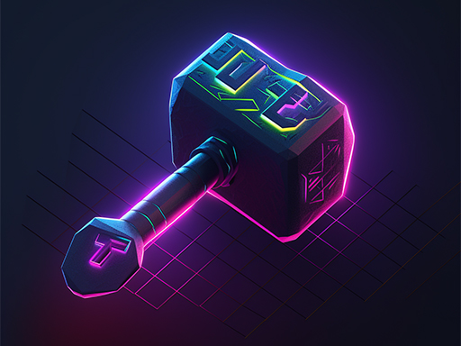

 

<h1>Extensions</h1>

General utilities to help with stuff in .NET Development, from Epiforge.

Supports `net6.0`, `net7.0`, `net8.0`, `net9.0`, and `net10.0`.


- [Libraries](#libraries)
  - [ Components](#-components)
    - [Property Change Notification](#property-change-notification)
    - [Disposal](#disposal)
    - [Reflection](#reflection)
    - [Exceptions](#exceptions)
    - [Threading](#threading)
  - [ Collections](#-collections)
    - [Generic](#generic)
    - [ObjectModel](#objectmodel)
    - [Specialized](#specialized)
  - [ Expressions](#-expressions)
    - [Observable](#observable)
    - [Observable Queries](#observable-queries)
      - [How Observable Queries Work and When to Use Them](#how-observable-queries-work-and-when-to-use-them)
  - [Platforms](#platforms)
    - [ Windows](#-windows)
- [License](#license)
- [Contributing](#contributing)
- [Acknowledgements](#acknowledgements)

# Libraries

##  Components
[ ](https://www.nuget.org/packages/Epiforge.Extensions.Components)

### Property Change Notification
This library offers the `PropertyChangeNotifier` class, which you may inherit from to quickly get all the property utilities we're all tired of copying and pasting everywhere.
Just call the protected `OnPropertyChanged` and `OnPropertyChanging` methods at the appropriate times from setters and compiler services will figure out what property you're in.
Or, if all you need to do is set the value of a field, `SetBackedProperty` couldn't make it any easier or convenient to handle that as efficiently as possible.
`DynamicPropertyChangeNotifier` is also available if your class needs to be dynamic.

Be sure to set the protected `Logger` property if you want the abstract class to log what's going on with property change notification.

### Disposal
This library features base classes that handle things we've written a thousand times over, this time involving disposal.
If you want to go with an implementation of the tried and true `IDisposable`, just inherit from `SyncDisposable`.
Want a taste of the new `IAsyncDisposable`? Then, inherit from `AsyncDisposable`.
Or, if you want to support both, there's `Disposable`.
Additionally, if your object needs to be dynamic, you can use `DynamicSyncDisposable`, `DynamicAsyncDisposable`, or `DynamicDisposable`.
Each of these features abstract methods to actually do your disposal.
On `Disposable` and `DynamicDisposable`, the asynchronous one, `DisposeAsyncCore`, is virtual and defaults to the synchronous `Dispose(bool)`, so a type whose cleanup is entirely synchronous only writes it once.
On `AsyncDisposable` and `DynamicAsyncDisposable` it stays abstract, because there is no synchronous path for it to delegate to.
But all of the base classes feature:

* proper implementation of the finalizer and use of `GC.SuppressFinalize`
* monitored access to disposal to ensure it can't happen twice
* the ability to override or "cancel" disposal by returning false from the abstract methods (e.g. you're reference counting and only want to dispose when your counter reaches zero)
* a protected `ThrowIfDisposed` method you can call to before doing anything that requires you haven't been disposed
* an `IsDisposed` property the value (and change notifications) of which are handled for you

This library provides the `IDisposalStatus` interface, which defines the `IsDisposed` property and all the base classes implement it.
This library also provides the `INotifyDisposing`, `INotifyDisposed`, and `INotifyDisposalOverridden` interfaces, which add events that notify of these occurrences.

Be sure to set the protected `Logger` property if you want the abstract class to log what's going on with disposal.

### Reflection
This library has useful tools for when you can't be certain of some things at compile time, such as types, methods, etc.
While .NET reflection is immensely powerful, prior to .NET 7, it's not very quick.
To address this, this library offers the following extension methods which will emit IL, generate delegates, and cache them for expedited use of Reflection:

* `ConstructorInfo.FastInvoke`: call a constructor only known at runtime quickly
* `MethodInfo.FastInvoke`: call a method only known at runtime quickly
* `PropertyInfo.FastGetValue`: get the value of a property only known at runtime quickly
* `PropertyInfo.FastSetValue`: set the value of a property only known at runtime quickly
* `Type.FastDefault`: get the default value of a type only known at runtime quickly
* `Type.GetImplementationEvents`: searches for the events of a type, including interfaces and interface inheritance
* `Type.GetImplementationMethods`: searches for the methods of a type, including interfaces and interface inheritance
* `Type.GetImplementationProperties`: searches for the properties of a type, including interfaces and interface inheritance

Use of these methods in .NET 7 or later will simply call the built-in methods, as they are now optimized.

This library also offers `FastComparer` and `FastEqualityComparer`, which implement `IComparer` and `IEqualityComaprer`, respectively, but quickly use the methods of `Comparer<>.Default` and `EqualityComaprer<>.Default`, respectively, to do their work.

In addition (pun intended), this library offers `GenericAddition`, `GenericSubtraction`, `GenericMultiplication`, and `GenericDivision`, which will produce delegates that will perform the respective operations with values of supplied generic type arguments.

### Exceptions
This library provides extension methods for dealing with exceptions:

* `GetFullDetails` - creates a representation of an exception and all of its inner exceptions, including exception types, messages, and stack traces, and traversing multiple inner exceptions in the case of `AggregateException` and `ReflectionTypeLoadException`

### Threading
This library provides classes for use in threading scenarios:

* `AsyncSynchronizationContext` - A SynchronizationContext that uses the Task Parallel Library (TPL) to process callbacks asynchronously

---

##  Collections
[ ](https://www.nuget.org/packages/Epiforge.Extensions.Collections)

This library provides a number of extension methods for collections and dictionaries:

* `EnumerableExtensions`, providing:
  * `FindIndex` - Finds the index of the first element in the source that satisfies the specified predicate
  * `FindLastIndex` - Finds the index of the last element in the source that satisfies the specified predicate
  * `FindIndicies` - Finds the indicies of the elements in the source that satisfy the specified predicate
  * `IndexOf` - Finds the first index of the specified item in the source
  * `LastIndexOf` - Finds the last index of the specified item in the source
  * `IndiciesOf` - Finds the indicies of the specified item in the source
* `DictionaryExtensions`, providing:
  * `GetOrAdd` - Adds a key/value pair to the specified `IDictionary` or `IDictionary<TKey, TValue>` by using the specified function if the key does not already exist (returns the new value, or the existing value if the key exists)
  * `TryRemove` - Attempts to remove and return the value that has the specified key from the specified `IDictionary` or `IDictionary<TKey, TValue>`

### Generic
* `ReadOnlyDictionary<TKey, TValue>` is a read-only wrapper for any classes implementing `IReadOnlyDictionary<TKey, TValue>`
* `ReadOnlyRangeDictionary<TKey, TValue>` is a read-only wrapper for any classes implementing `IReadOnlyRangeDictionary<TKey, TValue>`
* `ReadOnlyConcurrentDictionary<TKey, TValue>` is a read-only wrapper for `ObservableConcurrentDictionary<TKey, TValue>`
* `ReversedComparer<T>` is a comparer that reverses the comparison of another comparer (this is useful when you want to sort a list in the opposite order of the default sort order)
* `IHashKeys<TKey>` is implemented by keyed data structures that use an `IEqualityComparer<TKey>` to decide key equality, so that a consumer can discover the comparer a dictionary is actually using rather than assume the default (the observable queries in `Epiforge.Extensions.Expressions` do exactly this)
* `PrefixWeightedSequence<T>` is a sequence in which every position carries a weight. Insertion, removal, movement, and changing a weight are all logarithmic in the number of positions, as is finding a position by index, by the sum of the weights before it, or by which position a given offset falls within. `PrefixWeightedSequenceNode<T>` is the handle to a position and remains valid for as long as its item remains in the sequence, so you can hold onto one instead of re-finding an index after every change.

### ObjectModel
* `ObservableDictionary<TKey, TValue>`, `ObservableSortedDictionary<TKey, TValue>`, `ObservableConcurrentDictionary<TKey, TValue>` are counterparts to the BCL's `Dictionary<TKey, TValue>`, `SortedDictionary<TKey, TValue>`, and `ConcurrentDictionary<TKey, TValue>`, respectively, that implement the also included `IRangeDictionary<TKey, TValue>` and `INotifyDictionaryChanged<TKey, TValue>`. Ever want to add multiple items to a dictionary at once... or keep an eye on what's being done to it? Now you can.
* `ObservableRangeCollection<T>` is a counterpart to the BCL's `ObservableCollection<T>` which implements:
  * `AddRange` - Adds objects to the end of the collection
  * `GetAndRemoveAll` - Removes all object from the collection that satisfy a predicate
  * `GetAndRemoveAt` - Gets the element at the specified index and removes it from the collection
  * `GetRange` - Gets the elements in the range starting at the specified index and of the specified length
  * `InsertRange` - Inserts elements into the collection at the specified index
  * `MoveRange` - Moves the items at the specified index to a new location in the collection
  * `RemoveAll` - Removes all object from the collection that satisfy a predicate
  * `RemoveRange` - Removes the specified items from the collection *or* removes the specified range of items from the collection
  * `ReplaceAll` - Replace all items in the collection with the items in the specified collection
  * `ReplaceRange` - Replaces the specified range of items from the collection with the items in the specified collection
  * `Reset` - Resets the collection with the specified collection of items
* `ReadOnlyObservableRangeDictionary<TKey, TValue>` is a read-only wrapper for any classes implementing `IReadOnlyObservableRangeDictionary<TKey, TValue>`. It subscribes to what it wraps, so dispose of it when you are done with it.
* `ReadOnlyObservableRangeCollection<T>` is a read-only wrapper for any classes implementing `IReadOnlyObservableRangeCollection<T>`. It subscribes to what it wraps, so dispose of it when you are done with it.

### Specialized
* `EquatableList<T>` is an immutable list of items which may be compared with other instances of the same type and produces a hash code based on the permutation of its contents
* `NullableKeyDictionary<TKey, TValue>` and `NullableKeySortedDictionary<TKey, TValue>` are very slim implementations of `IDictionary<TKey, TValue>` that allow a single null key (useful for some edge cases in which a null key is simply going to happen and you need to be able to deal with it; otherwise, use other dictionary classes)
* `OrderedHashSet<T>` is a counterpart to the BCL's `HashSet<T>` that maintains the order of the elements in the set. All operations are still *O(1)*, just like the original, but if you enumerate over it you will get elements in the exact order they were added. There are also methods for manipulating the order

---

##  Expressions
[ ](https://www.nuget.org/packages/Epiforge.Extensions.Expressions)

This library has useful tools for dealing with expressions:

* `ExpressionEqualityComparer` - Defines methods to support the comparison of expression trees for equality
* `ExpressionExtensions`, providing:
  * `Duplicate` - Duplicates the specified expression tree
  * `SubstituteMethods` - Recursively scans an expression tree to replace invocations of specific methods with replacement methods

### Observable
This library accepts a `LambdaExpression` and arguments to pass to it, dissects the `LambdaExpression`'s body, and hooks into change notification events for properties (`INotifyPropertyChanged`), collections (`INotifyCollectionChanged`), and dictionaries (`Epiforge.Extensions.Collections.INotifyDictionaryChanged`).

```csharp
// Employee implements INotifyPropertyChanged
var elizabeth = Employee.GetByName("Elizabeth");
var observer = new ExpressionObserver();
var expr = observer.Observe(e => e.Name.Length, elizabeth);
// expr subscribed to elizabeth's PropertyChanged
```

Then, as changes involving any elements of the expression occur, a chain of automatic re-evaluation will get kicked off, possibly causing the observable expression's `Evaluation` property to change.

```csharp
var elizabeth = Employee.GetByName("Elizabeth");
var observer = new ExpressionObserver();
var expr = observer.Observe(e => e.Name.Length, elizabeth);
// expr.Evaluation.Result == 9
elizabeth.Name = "Lizzy";
// expr.Evaluation.Result == 5
```

Also, since exceptions may be encountered after an observable expression was created due to subsequent element changes, observable expressions include a `Fault` property in their evaluations, which will be set to the exception that was encountered during evaluation.

```csharp
var elizabeth = Employee.GetByName("Elizabeth");
var observer = new ExpressionObserver();
var expr = observer.Observe(e => e.Name.Length, elizabeth);
// expr.Evaluation.Fault is null
elizabeth.Name = null;
// expr.Evaluation.Fault is NullReferenceException
```

Observable expressions raise property change events of their own, so listen for those (kinda the whole point)!

```csharp
var elizabeth = Employee.GetByName("Elizabeth");
var observer = new ExpressionObserver();
var expr = observer.Observe(e => e.Name.Length, elizabeth);
expr.PropertyChanged += (sender, e) =>
{
    if (e.PropertyName == "Evaluation")
    {
        var (fault, result) = expr.Evaluation;
        if (fault is not null)
        {
            // Whoops
        }
        else
        {
            // Do something with result
        }
    }
};
```

While an expression is working out its new value it can pass through results that were never simultaneously true of its inputs; an addition whose two operands both derive from the same property has to compute one of them before the other. You are not told about those. Every event you receive carries a value the expression genuinely held, so a subscriber that redraws or broadcasts on one does that work once rather than twice, the second time only to correct the first.

Nor are you told anything at all when a change leaves the value where it found it. That is decided by a comparison, using the same equality the expression uses everywhere else, and it happens before `PropertyChanging` rather than after — so a handler for that event still reads the previous value, and a pair of events always means the value really moved.

When you dispose of your observable expression, it will disconnect from all the events.

```csharp
var elizabeth = Employee.GetByName("Elizabeth");
var observer = new ExpressionObserver();
using (var expr = observer.Observe(e => e.Name.Length, elizabeth))
{
    // expr subscribed to elizabeth's PropertyChanged
}
// expr unsubcribed from elizabeth's PropertyChanged
```

#### How an Expression Gets Observed
There are two mechanisms behind `Observe`. Which one an observation uses is settled when it is created and never changes for the rest of its life.

The general one builds a small graph: a node per subexpression, each subscribing to its own change sources and telling the nodes above it whenever its value moves. It copes with anything you can write.

The other skips the graph. It subscribes straight to the change sources and re-invokes a compiled delegate when one of them fires. It is faster to set up and faster to react, but it can only be used when every change source can be found without evaluating something that might change — which in practice means member and indexer access whose target is the argument, a constant, or a field, and the built-in operators over those.

```csharp
var observer = new ExpressionObserver();
var threshold = Payroll.GetThreshold();

observer.Observe(e => e.Salary, elizabeth);                         // direct
observer.Observe(e => e.Salary > threshold.Amount, elizabeth);      // direct: a captured local is a field
observer.Observe(e => e.Salary > this.threshold.Amount, elizabeth); // direct: so is a field of your own class
observer.Observe(e => e.Name.Length, elizabeth);                    // graph: Name is a property, so Length reads through something that can change
observer.Observe(e => e.Name == "Elizabeth", elizabeth);            // graph: string equality is a user-defined operator
observer.Observe(e => e.IsActive ? e.Name : e.Alias, elizabeth);    // graph: a branch is not subscribed to until it is taken
```

What decides this is field against property, not where the thing is declared. A field raises no change notification, so both mechanisms read it once when the observation begins and hold it, which leaves the fast path free to rely on it. A property can change and announce it, so anything read *through* a property is a moving target and goes to the graph. That is why `e => e.Name.Length` takes the graph while `e => e.Salary > this.threshold.Amount` does not, though both look like two hops.

Conditionals, `&&`, `||`, and `??` always use the graph, because subscribing to a side you have not reached would mean invoking a property getter earlier than the expression says to. So do user-defined operators — which includes `==` on strings — properties whose change notification you have asked the observer to ignore, and properties whose value the observer disposes.

Observing an eligible expression costs between a sixth and a ninth of what the graph costs and about half the memory, and a change to one of its sources arrives in roughly two thirds of the time. An observable query whose selector or predicate qualifies constructs in about a quarter of the time on a third of the memory, measured across ten thousand elements. Nothing about the values you receive or the events you receive them through differs between the two.

Set `UseDirectSubscription` to `false` on your options if you would rather always have the graph; it is `true` by default. And if you are curious why some particular expression is not eligible, you can ask directly:

```csharp
var analysis = new DirectSubscriptionAnalyzer(options).Analyze(expression.Body);
// analysis.IsEligible is false
// analysis.Ineligibility is DirectSubscriptionIneligibility.DeferredBranch
// analysis.IneligibleExpression is the part responsible
```

Because eligibility depends on which change sources the observer subscribes to at all, it is a property of your options as much as of your expression; hand the analyzer the same options you hand the observer.

##### Fields Are Read Once
This one is worth knowing because it is easy to write code that assumes otherwise. Whatever a field held when an observation began is what that observation goes on using — a captured local, which the compiler turns into a field, and a field of your own class alike. Assigning it afterward does not reach an observation that already exists.

```csharp
var threshold = low;
using var expr = observer.Observe(e => e.Salary > threshold.Amount, elizabeth);
threshold = high;    // expr is still comparing against low
low.Amount = 50000;  // expr re-evaluates
high.Amount = 90000; // expr does not
```

This has always been how the graph behaves, since it reads the field once when it builds the node and has nothing that could ever wake it to read again, and direct subscription behaves the same way. If you want the comparison to follow the value, do not assign the field — make the thing it points at a property of an object that notifies, and read that instead.

Observable expressions will also try to automatically dispose of disposable objects they create in the course of their evaluation when and where it makes sense. Use the `ExpressionObserverOptions` class for more direct control over this behavior.
You can use the `Optimizer` property to specify an optimization method to invoke automatically during the observable expression creation process.
We recommend Tuomas Hietanen's [Linq.Expression.Optimizer](https://thorium.github.io/Linq.Expression.Optimizer), the utilization of which would look like so:

```csharp
var options = new ExpressionObserverOptions { Optimizer = ExpressionOptimizer.tryVisit };

var a = Expression.Parameter(typeof(bool));
var b = Expression.Parameter(typeof(bool));

var lambda = Expression.Lambda<Func<bool, bool, bool>>
(
    Expression.AndAlso
    (
        Expression.Not(a),
        Expression.Not(b)
    ),
    a,
    b
); // lambda explicitly defined as (a, b) => !a && !b

var observer = new ExpressionObserver(options);
var expr = observer.Observe<bool>(lambda, false, false);
// optimizer has intervened and defined expr as (a, b) => !(a || b)
// (because Augustus De Morgan said they're essentially the same thing, but this involves less steps)
```

### Observable Queries
This library provides re-implementations of LINQ operations, but instead of returning `IEnumerable<T>`s and simple values, these return `IObservableCollectionQuery<T>`s, `IObservableDictionaryQuery<TKey, TValue>`s, and `IObservableScalarQuery<T>`s.
This is because, unlike traditional LINQ operations, these implementations continuously update their results until those results are disposed.
What they hand back is a read-only view of the source: change the source, and the query brings itself up to date. Queries do not implement the mutating range collection and dictionary interfaces, because a query result is not somewhere you put things.

But... what could cause those updates?

* the source is enumerable, implements `INotifyCollectionChanged`, and raises a `CollectionChanged` event
* the source is a dictionary, implements `Epiforge.Extensions.Collections.INotifyDictionaryChanged<TKey, TValue>`, and raises a `DictionaryChanged` event
* the elements in the enumerable (or the values in the dictionary) implement `INotifyPropertyChanged` and raise a `PropertyChanged` event
* a reference enclosed by a selector or a predicate passed to the method implements `INotifyCollectionChanged`, `Epiforge.Extensions.Collections.INotifyDictionaryChanged<TKey, TValue>`, or `INotifyPropertyChanged` and raises one of their events

That last one might be a little surprising, but this is because all selectors and predicates passed to Observable Query methods become Observable Expressions (see above).
This means that you will not be able to pass one that an `ExpressionObserver` cannot observe (e.g. a lambda expression that can't be converted to an expression tree or that contains nodes that are unsupported).
But, in exchange for this, you get all kinds of notification plumbing that's just handled for you behind the scenes.

Suppose, for example, you're working on an app that displays a list of notes and you want the notes to be shown in descending order of when they were last edited.

```csharp
var notes = new ObservableCollection<Note>();
var collectionObserver = new CollectionObserver();

var observedNotes = collectionObserver.ObserveReadOnlyList(notes);
var orderedNotes = observedNotes.ObserveOrderBy(note => note.LastEdited, isDescending: true);
notesViewControl.ItemsSource = orderedNotes;
```

From then on, as you add `Note`s to the `notes` observable collection, the `IObservableCollectionQuery<Note>` named `orderedNotes` will be kept ordered so that `notesViewControl` displays them in the preferred order.

Since `IObservableCollectionQuery<T>`'s are automatically subscribing to events for you, you do need to call `Dispose` on them when you don't need them any more.

```csharp
void Page_Unload(object? sender, EventArgs e)
{
    orderedNotes.Dispose();
    observedNotes.Dispose();
}
```

Ahh, but what about exceptions?
Well, Observable Expressions contain a `Fault` element in their `Evaluation` properties, but... you don't really see those Observable Expressions as an Observable Query caller, do ya?
For that reason, Observable Queries all have `OperationFault` properties.
You may subscribe to their `PropertyChanging` and `PropertyChanged` events to be notified when an Observable Expression or the overall Observable Query runs into a problem.
If there is more than one fault in play, the value of `OperationFault` will be an `AggregateException`.

Dictionary queries adopt the key comparer of the dictionary they observe, discovering it through `Epiforge.Extensions.Collections.Generic.IHashKeys<TKey>` or a `Dictionary<TKey, TValue>`'s own `Comparer`, so a query over a case-insensitive dictionary is itself case-insensitive.

`ObserveGroupBy`, `ObserveToLookup`, and `ObserveDistinct` do not order their results the way LINQ does.
Groupings are ordered by when they were created and the elements of a grouping by when they were added, rather than by where they occur in the source.
This is deliberate: holding a grouping at the position of its key's first occurrence would mean moving that grouping every time an element was inserted ahead of it, announcing a change to something whose membership did not change, which is the opposite of what an Observable Query is for.
Call `ObserveOrderBy` on the query, or on a grouping, when you want a defined order.

Reach for `foreach` rather than the indexer, because the difference between them is larger than it looks and grows with the collection.
An enumeration takes the query's lock once and then walks a list, while the indexer takes that lock again for every element you ask for; on a large collection it must also descend a tree to find each one, because a query keeps its elements' positions in one so that a change repairs only what it touched.
Walking ten thousand elements by index instead of by enumerator measured between sixty-seven and seventy-nine times slower; at a hundred elements it was ten to fifteen, and there the repeated locking is the whole of it.
Where you do need elements by position more than once, copy the query's contents and index the copy.

Since the `ExpressionObserver` has a number of options governing its behavior, you may optionally pass one you've made to the constructor of `CollectionObserver` to ensure those options are obeyed when Observable Expressions are created to enable your Observable Queries.

#### How Observable Queries Work and When to Use Them
It is worth being plain about what kind of thing this is, because "LINQ, but observable" undersells it and sets the wrong expectations.

A LINQ query is a description of a computation you run. Run it again and it does all of the work again. An Observable Query is not re-run. It is a small machine that holds the answer and repairs it, so when something changes, only the parts of the answer that depended on that thing are recomputed. The work is proportional to what changed rather than to how much data you have. If you want the name the literature uses for this idea, it is incremental, or self-adjusting, computation.

Three things that might otherwise look like arbitrary restrictions fall straight out of that:
1. Your selectors and predicates have to be expression trees rather than delegates because the machine has to read them to find out what they depend on. A delegate is opaque; there is nothing in it to subscribe to.
2. You have to dispose of a query because it is holding subscriptions to everything it depends on, and those subscriptions are the entire reason the answer stays right.
3. Faults reach you through `OperationFault` instead of being thrown, because the evaluation that failed happened later, on whatever thread raised the change. By then there is no call of yours left on the stack to throw out of.

What is not free is construction. Building the machine means building an observable expression for every element the query touches, and that is proportional to the size of the collection. So build a query once and hold onto it. Do not build one per frame, per request, or per keystroke. The bargain is that you pay up front and then stop paying to read.

Which is also how to decide whether you want one. If you compute a result once and move on, plain LINQ is cheaper and simpler, and you should use it. If a result has to stay correct across a long run of small changes, such as a list someone is looking at, a running total, or a filter someone is typing into, that is what these are for.

---

## Platforms

###  Windows
[ ](https://www.nuget.org/packages/Epiforge.Extensions.Platforms.Windows)

This library includes utilities for interoperation with Microsoft Windows, including:

* `Activation` - provides information relating to Windows Activation
* `ConsoleAssist` - provides methods for interacting with consoles
* `Cursor` - wraps Win32 API methods dealing with the cursor
* `Shell` - wraps methods of the WScript.Shell COM object (specifically useful for invoking its `CreateShortcut` function)
* `Theme` - represents the current Windows theme (its `Color` and `IsDark` properties report what Windows says and are not settable)
* `User` - provides properties concerning the user, including `IdleTime`; `GetIdleTime` returns the same figure along with whether it is exact, which it is except when the session could not supply an absolute last-input timestamp and the system tick count has already wrapped
* `WindowingSystem` - provides methods for dealing with the windowing system, including reading and setting the foreground window, reading its position, and flashing windows

Also provides extension methods for dealing with processes, including:

* `CloseMainWindowAsync` - close the main window of the specified process
* `GetParentProcess` - gets the parent process of the specified process

---

# License
[Apache 2.0 License](LICENSE)

# Contributing
[Click here](CONTRIBUTING.md) to learn how to contribute.

# Acknowledgements
Makes use of the following excellent libraries:
* [AsyncEx](https://github.com/StephenCleary/AsyncEx) by Stephen Cleary
* [Ben.Demystifier](https://github.com/benaadams/Ben.Demystifier) by Ben Adams
* [PolySharp](https://github.com/Sergio0694/PolySharp) by Sergio Pedri